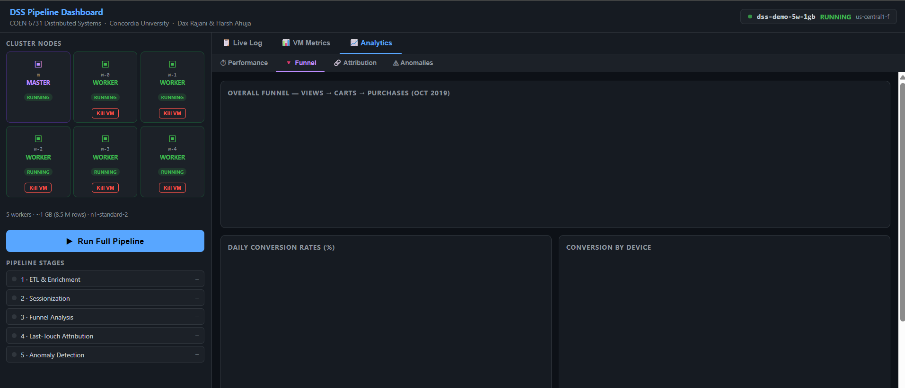
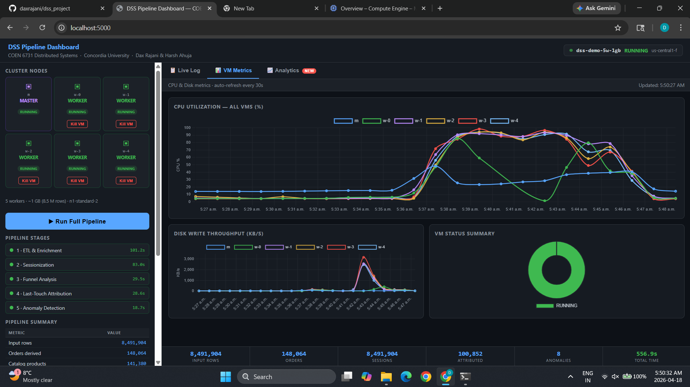
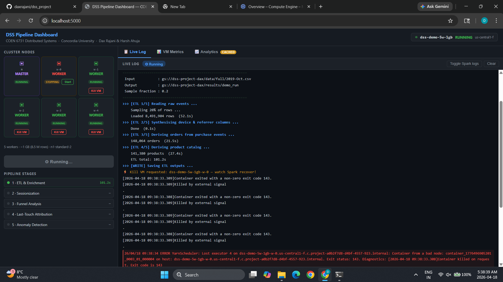
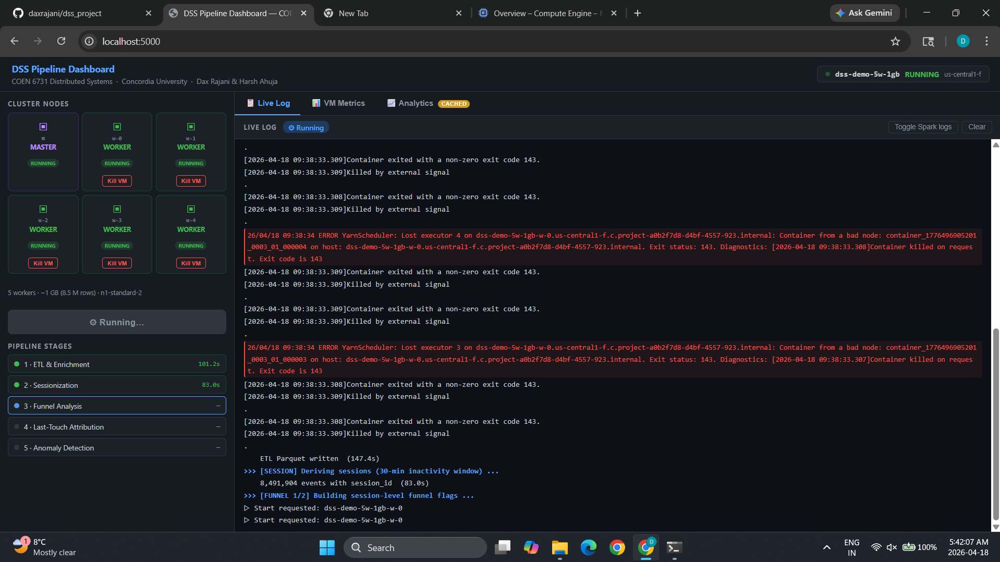
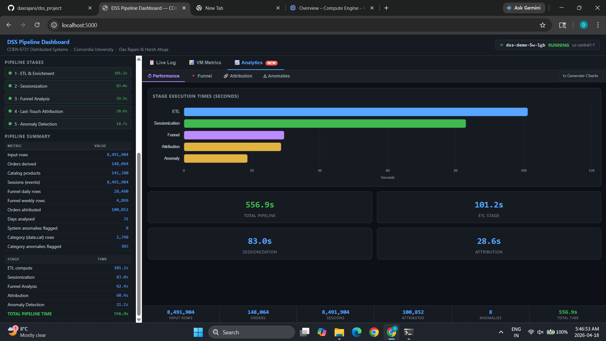
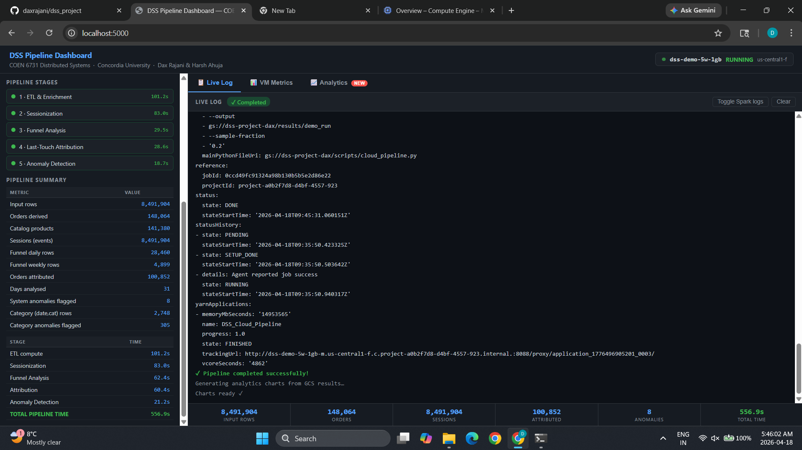
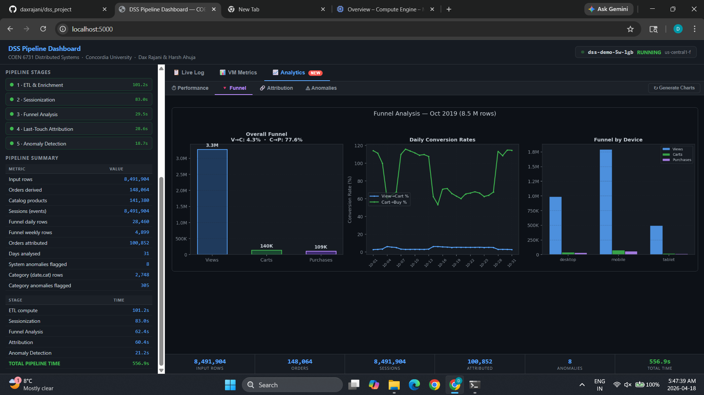
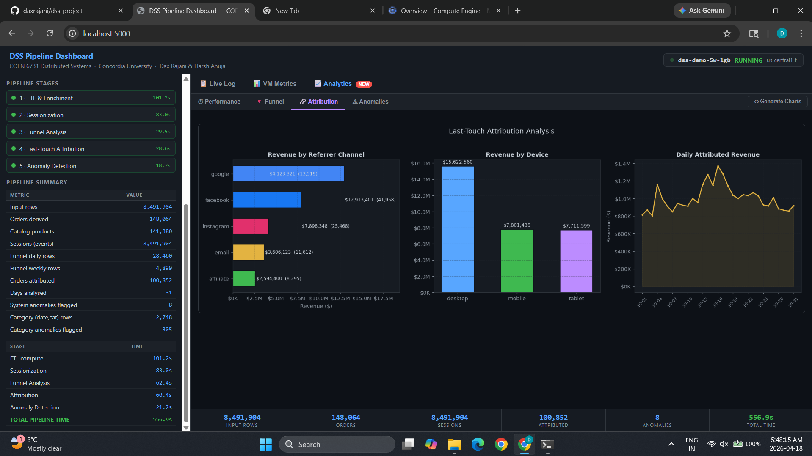
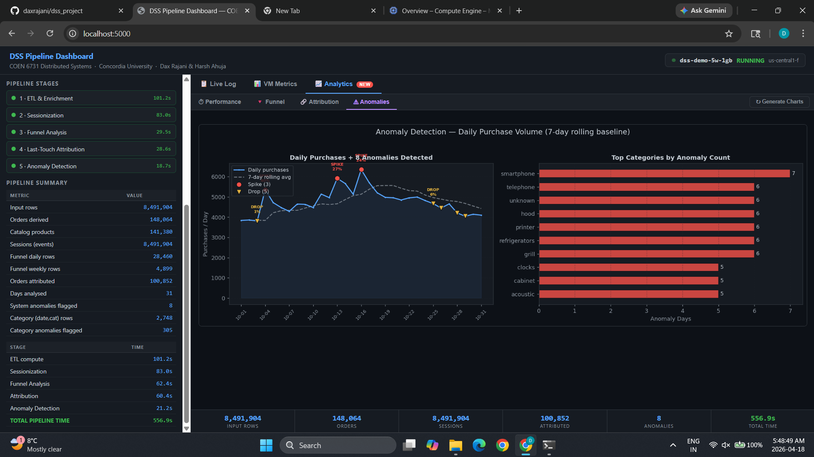

# Scalable E-commerce Analytics Pipeline with PySpark and GCP Dataproc

**Authors:** Dax Rajani (40294118) and Harsh Ahuja (40301748)  
**Course:** COEN 6731 Distributed Software Systems, Concordia University, Winter 2026

[](https://codespaces.new/daxrajani/dss_project)

---

## What This Project Does

This project builds a distributed data processing pipeline using Apache Spark on Google Cloud Dataproc. It ingests the REES46 e-commerce dataset (42 million events, 5.3 GB) and runs it through five analytical stages: ETL and enrichment, sessionization, funnel analysis, last-touch attribution, and anomaly detection. It also includes a live web dashboard where you can start the cluster, submit the pipeline, watch it run in real time, and explore the analytics results through interactive charts.

The GCP project, bucket, dataset, and cluster are already deployed and configured. You do not need to set up anything on Google Cloud.

---

## Before You Run Any Command

**All commands in this README must be run inside the Codespaces terminal.** Here is how to get there:

1. Click the **Open in GitHub Codespaces** badge at the top of this page
2. Wait for the environment to finish building (this takes about 5 to 8 minutes the first time)
3. Once the Codespace loads, open a terminal by going to the top menu and clicking **Terminal > New Terminal**

Every time you open a new terminal session, you must run this command first before anything else. It loads the Google Cloud SDK into your current session:

```bash
source ~/google-cloud-sdk/path.bash.inc
```

You do not need to install any Python packages in Codespaces. Everything is installed automatically when the environment builds. If you are running this locally outside of Codespaces, run `pip install -r requirements.txt` before anything else.

---

## Screenshots

| | |
|---|---|
|  |  |
| *Live pipeline execution, 5 workers, 8.5M rows* | *Real-time CPU and disk metrics across all 6 VMs* |
|  |  |
| *Worker w-0 killed mid-pipeline, Spark detects and recovers* | *w-0 restarted, pipeline continues automatically* |
|  |  |
| *Stage timings: Total 556.9s, ETL 101.2s, Sessionization 83.0s* | *Pipeline completed with all metrics in left sidebar* |
|  |  |
| *Funnel: 3.3M views, 140K carts, 109K purchases* | *Attribution: Facebook $12.9M, Google $4.1M revenue* |
|  | |
| *Anomaly detection: 8 anomalies flagged (3 spikes and 5 drops)* | |

---

## Key Numbers from Live GCP Runs

| Metric | Value |
|---|---|
| Dataset size | 42,448,764 events, October 2019 |
| Orders derived | 742,849 |
| Distinct products | 166,794 |
| Sessions identified | 4,000,000+ |
| Orders attributed | 525,580 (5GB run) |
| Anomaly days flagged | 8 out of 31 days |
| Best throughput | 125,961 rows/sec (5 workers, 10GB) |

---

## Design Decisions

### Why 30 Minutes for Session Inactivity

The 30-minute inactivity threshold for sessionization is the industry standard established by Google Analytics and widely adopted across web analytics platforms. The reasoning is grounded in observed user behavior: a typical e-commerce browsing session involves viewing product pages, adding items to a cart, and completing a purchase, all of which happen within a continuous window of activity. If a user goes idle for more than 30 minutes, it is statistically likely they have stepped away and any subsequent activity represents a new intent and a new visit.

Using a shorter threshold like 10 minutes would incorrectly split active sessions where a user pauses briefly to read a product review or compare prices on another tab. Using a longer threshold like 60 minutes would merge what are genuinely separate visits into a single session, inflating session length and distorting funnel metrics. The 30-minute value was chosen because it balances these two error types and aligns with what the analytics industry has validated at scale.

### Why 24 Hours for Attribution Lookback

The 24-hour lookback window for last-touch attribution defines how far back in time we search for the referrer session that gets credit for an order. This window was chosen for two reasons.

First, e-commerce purchase decisions in the fast-moving consumer goods and electronics categories that dominate this dataset are largely same-day decisions. A user who clicks a Facebook ad and then purchases within the same day is a clear attribution case. A user who purchased 5 days after a referral visit is likely making an independent decision driven by factors outside the referral.

Second, a longer window introduces noise. If the lookback is 7 days, a single instagram referral session can get credited for multiple unrelated purchases spread across the week, which overstates the impact of that channel. The 24-hour window keeps attribution tight and defensible. In the results, 525,580 out of 742,849 orders (70.7%) were successfully attributed, which indicates the window is wide enough to capture genuine referral-driven purchases without being so narrow that it misses same-day conversions.

---

## Pipeline Stages

The pipeline has five stages, all contained in `src/cloud_pipeline.py` as a single self-contained Dataproc job.

| Stage | Name | What It Does |
|---|---|---|
| 1 | ETL and Enrichment | Reads the raw CSV, synthesizes `device` and `referrer` fields using a CRC32 hash of `user_session`, derives orders and catalog tables, and writes everything to Parquet format |
| 2 | Sessionization | Groups events into sessions using a 30 minute inactivity threshold per user with Spark window functions |
| 3 | Funnel Analysis | Computes View to Cart to Purchase conversion rates broken down by category, device, and referrer at daily and weekly granularity |
| 4 | Last-Touch Attribution | For each order, finds the most recent non-direct referrer session within a 24 hour lookback window using a temporal join and row number window function |
| 5 | Anomaly Detection | Computes a 7-day rolling average and z-score for daily purchase counts, flags days where the z-score exceeds 2 as SPIKE or DROP anomalies, and runs the same analysis per category |

---

## Option A: Live Web Dashboard (Recommended)

This is the best way to see the full project in action. The dashboard shows the live Dataproc cluster, lets you submit the pipeline, streams the logs as it runs, and displays the analytics results in interactive charts.

**Run all of the following commands in the Codespaces terminal.**

**Step 1.** Load the Google Cloud SDK. Run this every time you open a new terminal:

```bash
source ~/google-cloud-sdk/path.bash.inc
```

**Step 2.** Start the dashboard:

```bash
bash dashboard.sh
```

**Step 3.** Open the dashboard in your browser. Codespaces will show a popup asking if you want to open port 5000. Click **Open in Browser**. If the popup does not appear, go to the **Ports** tab at the bottom of the Codespaces window and click the globe icon next to port 5000.

**What you will see in the dashboard:**

- All 6 Dataproc VMs are listed (1 master node named `dss-demo-5w-1gb-m` and 5 worker nodes named `w-0` through `w-4`) with their current status and machine type
- Click **Run Full Pipeline** to submit the job. The cluster starts automatically if it is stopped, and the live log streams directly into the dashboard
- The pipeline runs through all 5 stages and shows the time taken for each one
- After the job finishes, click **Generate Charts** to download the results from GCS and produce analytics charts
- Use the **Funnel**, **Attribution**, and **Anomalies** tabs to explore the results
- The **VM Metrics** tab shows real-time CPU utilization and disk throughput for every node
- The **Kill VM** button on any worker node shuts it down mid-run to demonstrate Spark fault tolerance

---

## Option B: Command Line Demos

These commands run specific parts of the project from the terminal. Some work entirely locally with no cloud access needed, and some submit jobs to GCP.

**Run all of the following commands in the Codespaces terminal.**

**Step 1.** Load the Google Cloud SDK first. Run this every time you open a new terminal:

```bash
source ~/google-cloud-sdk/path.bash.inc
```

**Step 2.** Choose which demo to run:

**Show pre-computed benchmark results (no GCP needed, runs instantly):**
```bash
bash demo.sh results
```
This prints the full scaling study table showing how throughput improves with more workers and more data, along with the results from the three optimization experiments.

**Real-time streaming anomaly detection (no GCP needed, runs for about 60 seconds):**
```bash
bash demo.sh stream
```
This runs a complete Spark Structured Streaming pipeline entirely on your local machine inside the Codespace. See the streaming section below for a full explanation of what it does.

**Regenerate all performance charts from saved logs (no GCP needed):**
```bash
bash demo.sh perf
```
This reads the pre-saved benchmark logs from `results/` and regenerates all 6 performance and scaling charts as PNG files in `results/charts/`.

**Submit the live pipeline to GCP Dataproc:**
```bash
bash demo.sh cloud
```
This submits the full 5-stage pipeline to the GCP Dataproc cluster using 5 workers and a 20% sample of the dataset (about 8.5 million rows). The job takes about 4 minutes to complete. The cluster starts automatically if it is stopped.

**Download GCS output and generate analytics charts:**
```bash
bash demo.sh analyze
```
This downloads the Parquet output from the last pipeline run on GCS, generates the funnel, attribution, and anomaly charts, and prints a summary of the results.

---

## Real-Time Streaming Demo

This demo runs a complete Spark Structured Streaming pipeline on your local machine. It does not require any GCP access.

**Run the following commands in the Codespaces terminal:**

```bash
source ~/google-cloud-sdk/path.bash.inc
bash demo.sh stream
```

What happens when you run it:

- A background script (`src/stream_producer.py`) generates synthetic e-commerce events and writes them as CSV batches to `data/raw/stream_input/` every 2 seconds
- A Spark Structured Streaming job (`src/streaming_job.py`) watches that directory and processes each batch as it arrives
- The job computes purchase counts per category per 5-minute window and flags SPIKE anomalies when the count exceeds a threshold
- Every 5th batch includes an injected spike so you can see the anomaly detection fire
- The demo runs for 60 seconds and then exits cleanly

---

## Fault Tolerance Demo

This demo shows how Spark recovers automatically when a worker node fails mid-computation.

**Run the following commands in the Codespaces terminal to start the pipeline first:**

```bash
source ~/google-cloud-sdk/path.bash.inc
bash dashboard.sh
```

Then open the dashboard in your browser and follow these steps:

1. Click **Run Full Pipeline** and wait for the pipeline to start running (you will see log lines streaming in)
2. While the pipeline is running, click **Kill VM** on any worker node such as `w-0`
3. The VM shuts down. Watch the live log show that Spark detected the lost executor
4. Spark automatically reassigns the failed tasks to the remaining workers
5. The pipeline continues and completes successfully, taking slightly longer than usual
6. Click **Start** on `w-0` to bring it back online

Screenshots of this entire sequence are in `screenshots/`.

---

## Running the Full Scaling Study

This runs all 9 benchmark combinations (2, 4, and 5 workers with 1 GB, 5 GB, and 10 GB of data) sequentially on GCP Dataproc. Each run submits a job, waits for it to complete, and saves the results. The full study takes about 2 hours to complete.

**Run the following commands in the Codespaces terminal:**

```bash
source ~/google-cloud-sdk/path.bash.inc
bash src/run_scaling_study.sh
```

Results are saved to `results/` as CSV and log files. Charts are generated automatically when all runs complete. Pre-computed results from our runs are already in `results/` if you want to view them without re-running.

---

## Scaling Study Results

| Workers | Data | Rows | Total Time | Rows/sec |
|---|---|---|---|---|
| 2 | 1 GB | 8.5M | 673.6s | 12,607 |
| 2 | 5 GB | 42.4M | 1,021.8s | 41,543 |
| 2 | 10 GB | 84.9M | 1,378.9s | 61,569 |
| 4 | 1 GB | 8.5M | 282.4s | 30,070 |
| 4 | 5 GB | 42.4M | 569.0s | 74,602 |
| 4 | 10 GB | 84.9M | 799.8s | 106,148 |
| **5** | **1 GB** | **8.5M** | **256.9s** | **33,055** |
| **5** | **5 GB** | **42.4M** | **409.7s** | **103,609** |
| **5** | **10 GB** | **84.9M** | **674.0s** | **125,961** |

Going from 2 to 5 workers gives a 2.0 to 2.6x speedup. Scaling from 1 GB to 10 GB on 5 workers adds only 2.6x more time for 10x more data, which demonstrates strong sublinear scaling.

---

## Optimization Experiments

Three Spark optimization techniques were tested and compared against a baseline. Results are pre-saved in `results/`.

| Experiment | Baseline | Optimized | Speedup |
|---|---|---|---|
| Broadcast join vs shuffle join | 11.33s | 7.15s | **1.58x** |
| Partition pruning, single day | 4.25s | 1.37s | **3.11x** |
| Partition pruning, 7-day range | 3.09s | 1.78s | **1.73x** |
| Skew salting | 34.6s | 79.1s | 0.44x (data is already uniform so salting adds overhead rather than helping) |

To view the full results in the terminal, run:

```bash
bash demo.sh results
```

To regenerate the charts from the saved logs, run:

```bash
source ~/google-cloud-sdk/path.bash.inc
bash demo.sh perf
```

---

## Repository Structure

```
dss_project/
├── demo.sh                          # Main demo script (cloud/stream/results/perf/analyze)
├── dashboard.sh                     # Starts the live web dashboard on port 5000
├── requirements.txt                 # Python package dependencies
│
├── src/
│   ├── cloud_pipeline.py            # Self-contained Dataproc job with all 5 pipeline stages
│   ├── etl_enrichment.py            # Stage 1 as a standalone script
│   ├── benchmark_job.py             # Stages 2 and 3 as a standalone script
│   ├── attribution.py               # Stage 4 as a standalone script
│   ├── anomaly_detection.py         # Stage 5 as a standalone script
│   │
│   ├── cloud_benchmark.sh           # Submits cloud_pipeline.py to Dataproc
│   ├── run_scaling_study.sh         # Runs all 9 benchmark combinations
│   │
│   ├── cloud_broadcast_join.py      # Broadcast join optimization experiment
│   ├── cloud_partition_analysis.py  # Partition pruning optimization experiment
│   ├── cloud_skew_analysis.py       # Data skew and salting experiment
│   │
│   ├── streaming_job.py             # Spark Structured Streaming job for real-time anomaly detection
│   ├── stream_producer.py           # Generates synthetic event batches for the streaming demo
│   │
│   ├── dashboard_charts.py          # Generates analytics charts from GCS Parquet output
│   ├── generate_perf_charts.py      # Generates performance and scaling charts from benchmark logs
│   ├── analyze_gcs_results.py       # Downloads GCS results and prints a summary
│   │
│   └── dashboard/
│       ├── app.py                   # Flask backend for the web dashboard
│       └── templates/index.html     # Dashboard frontend with nodes, logs, metrics, and charts
│
├── results/
│   ├── benchmark_summary.csv        # Pre-computed results from all 9 scaling runs
│   ├── cloud_*w_*.log               # Individual Dataproc job logs per run
│   ├── broadcast_join_results.log   # Broadcast join experiment output
│   ├── partition_analysis_results.log
│   ├── skew_analysis_results.log
│   └── charts/                      # PNG charts for all experiments
│
└── screenshots/                     # Screenshots from live GCP runs
```

---

## GCP Configuration

Everything is pre-configured. No changes are needed.

| Setting | Value |
|---|---|
| GCP Project | `project-a0b2f7d8-d4bf-4557-923` |
| GCS Bucket | `gs://dss-project-dax` |
| Input data | `gs://dss-project-dax/data/full/2019-Oct.csv` |
| Pipeline scripts | `gs://dss-project-dax/scripts/` |
| Demo cluster | `dss-demo-5w-1gb` (1 master and 5 workers, n2-standard-2) |
| Region | Auto-selected across 9 fallback regions |

The cluster lifecycle is fully automated. If the cluster does not exist it is created automatically with fallback across machine types and regions. If it is stopped it gets started. If it is already running it gets reused. After each job the cluster is stopped but kept so the next run starts faster without recreating it.

---

## Dataset

**REES46 eCommerce behavior data** from Kaggle, October 2019  
42,448,764 events, 5.3 GB  
Columns: `event_time, event_type, product_id, category_id, category_code, brand, price, user_id, user_session`

Two fields are not present in the original dataset and are synthesized deterministically using `crc32(user_session) % 100` so that results are reproducible:

- `device`: mobile 55%, desktop 30%, tablet 15%
- `referrer`: direct 40%, google 25%, facebook 15%, instagram 8%, email 7%, affiliate 5%
